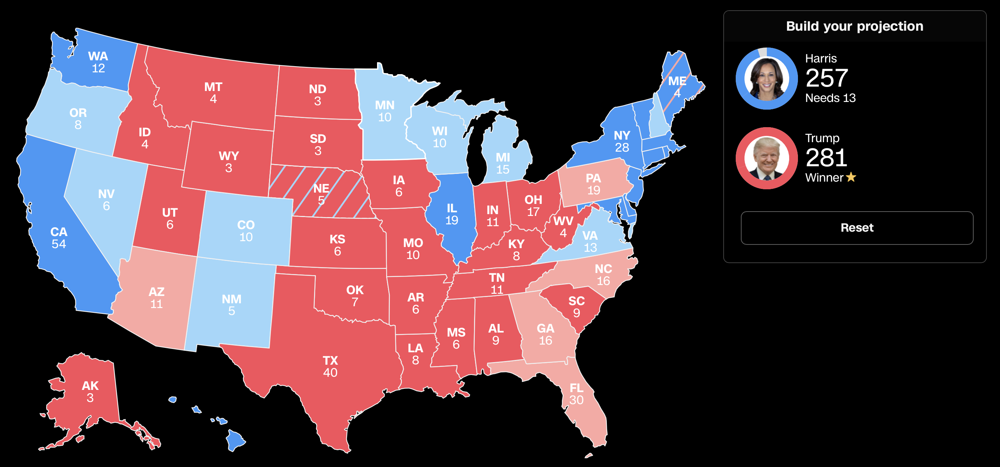

```{r setup, include=FALSE}
knitr::opts_chunk$set(echo = TRUE)
```

Disclamer: i collected all the data and ran all this models in like 2 hours. I did not put much effort into this, its not very good. Just for fun. Might add ridge lasso later but lazy.

-   Very low sample size as well - just 22 presidential elections included as training data.
-   Also, this is a very unique presidential election - may be flawed to assume that past data can predict what will happen this time.

**3 types of models on here (use table of contents to access or scroll down)**

1.  Electoral College Prediction Models
2.  Winner/Loser Prediction Models
3.  My own gut based prediction (with map!)

<br />

# **Electoral Votes Predictions**

I create 3 different predictions for the 2024 election for each model.

-   Most Likely Scenario: polls say harris leads by 1.2% (according to 538 aggregator, seems to be most accurate)

-   Moderately Likely Scenario: polls say harris leads by 2% (the economist aggregator rounded up)

-   Unlikely Scenario: If polls say harris leads by 3% (a few polls say this, but unlikely to be true).

<br />

### 2 Best Models (by recent performance)

Random Forest Model (5 Variables Bootstrap Sampled) With Height Excluded:

**Most Likely: If harris leads 1.2% in polls: Harris 266.97, [Trump 271.03]{.underline}**

-   If harris leads 2% in polls: [Harris 269.24]{.underline}, Trump 268.76

-   If harris leads 3% in polls (unlikely): [Harris 297]{.underline}, Trump 241

Past Performance (5 out of last 6 elections correct winner)

|                    | 2020  | 2016    | 2012  | 2008   | 2004  | 2000  |
|:-------------------|:------|:--------|:------|:-------|:------|:------|
| Model (Incumbent)  | 250.5 | 264.2   | 317.4 | 188.6  | 285.1 | 272.9 |
| Correct Winner?    | Yes   | Yes     | Yes   | Yes    | Yes   | No    |
| Actual (Incumbent) | 232   | 227     | 332   | 173    | 286   | 266   |
| Incumbent          | Trump | Clinton | Obama | McCain | Bush  | Gore  |

\% of Variance Explained in $Y$ (Electoral Votes Received by Incumbent): 42.15%

<br />

<br />

Random Forest Model (5 Variables Bootstrap Sampled) with Height Included:

**Most Likely: If harris leads 1.2% in polls: Harris 267.88, [Trump 270.12]{.underline}**

-   If harris leads 2% in polls: [Harris 271.96]{.underline}, Trump 266.04

-   If harris leads 3% in polls (unlikely): [Harris 296.45]{.underline}, Trump 241.5

Past performance (5 out of last 6 elections correct winner)

|                    | 2020  | 2016    | 2012  | 2008   | 2004  | 2000  |
|:-------------------|:------|:--------|:------|:-------|:------|:------|
| Model (Incumbent)  | 253.5 | 267.6   | 313.7 | 191.2  | 272.7 | 276.2 |
| Correct Winner?    | Yes   | Yes     | Yes   | Yes    | Yes   | No    |
| Actual (Incumbent) | 232   | 227     | 332   | 173    | 286   | 266   |
| Incumbent          | Trump | Clinton | Obama | McCain | Bush  | Gore  |

\% of Variance Explained in $Y$ (Electoral Votes Received by Incumbent): 37.64%

<br />

### Other Models

**Random Forest (20 Variables Boostrap Sampled) with Heigh**t:

-   If harris leads 1.2% in polls: Harris 229.14 Electoral votes, [Trump 308.86]{.underline}

-   If Harris leads 2% in polls: Harris 232.33 Electoral Votes, [Trump 305.67]{.underline}

-   If Harris leads by 3% in polls (unlikely): [Harris 290.29]{.underline} Electoral Votes, Trump 247.7

Past performance (4 out of last 6 elections correct winner)

|                    | 2020  | 2016    | 2012  | 2008   | 2004 | 2000  |
|:-------------------|:------|:--------|:------|:-------|:-----|:------|
| Model (Incumbent)  | 237.6 | 278.9   | 300.2 | 186.5  | 259  | 261.4 |
| Correct Winner?    | Yes   | No      | Yes   | Yes    | No   | Yes   |
| Actual (Incumbent) | 232   | 227     | 332   | 173    | 286  | 266   |
| Incumbent          | Trump | Clinton | Obama | McCain | Bush | Gore  |

\% of Variance Explained in $Y$ (Electoral Votes Recieved by Incumbent): 56.94%

<br />

**Bagging Model with Height Excluded**:

-   If harris leads 1.2% in polls: 229.66 Harris, [308.34 Trump]{.underline}

-   If harris leads 2% in polls: 235.41 Harris, [302.59 Trump]{.underline}

-   If harris leads by 3% in polls (unlikely): [307 Harris]{.underline}, 231 Trump

Past Performance (4 out of last 6 elections correct winner)

|                    | 2020  | 2016    | 2012  | 2008   | 2004  | 2000  |
|:-------------------|:------|:--------|:------|:-------|:------|:------|
| Model (Incumbent)  | 225   | 294.7   | 302.8 | 190.4  | 263.2 | 253.7 |
| Correct Winner?    | Yes   | No      | Yes   | Yes    | No    | Yes   |
| Actual (Incumbent) | 232   | 227     | 332   | 173    | 286   | 266   |
| Incumbent          | Trump | Clinton | Obama | McCain | Bush  | Gore  |

\% of Variance Explained in $Y$ (Electoral Votes Received by Incumbent): 54.12%

<br />

**Random Forest (19 Variables Bootstrap Sampled) With Height Excluded**:

-   If harris leads 1.2% in polls: 227.07 Harris, [310.93 Trump]{.underline}

-   If harris leads 2% in polls: 229.9 Harris, [308.1 Trump]{.underline}

-   If harris leads 3% in polls (unlikely): [290.72 Harris]{.underline}, 247.28 Harris

Past Performance (4 out of last 6 elections correct winner)

|                    | 2020  | 2016    | 2012  | 2008   | 2004  | 2000  |
|:-------------------|:------|:--------|:------|:-------|:------|:------|
| Model (Incumbent)  | 227.5 | 281.8   | 306.2 | 184.2  | 264.3 | 258.2 |
| Correct Winner?    | Yes   | No      | Yes   | Yes    | No    | Yes   |
| Actual (Incumbent) | 232   | 227     | 332   | 173    | 286   | 266   |
| Incumbent          | Trump | Clinton | Obama | McCain | Bush  | Gore  |

\% of Variance Explained in $Y$ (Electoral Votes Received by Incumbent): 56.42%

<br />

**Bagging With Height**:

-   If harris leads 1.2% in polls: Harris 215.74, [Trump 332.26]{.underline}

-   If harris leads 2% in polls: Harris 221.1, [Trump 316.9]{.underline}

-   If harris leads 3% in polls (unlikely): [Harris 293.18]{.underline}, Trump 244.82

Past Peformance (4 out of last 6 elections correct winner)

|                    | 2020  | 2016    | 2012  | 2008   | 2004  | 2000  |
|:-------------------|:------|:--------|:------|:-------|:------|:------|
| Model (Incumbent)  | 230.7 | 292.4   | 296.2 | 185.2  | 254.4 | 259.4 |
| Correct Winner?    | Yes   | No      | Yes   | Yes    | No    | Yes   |
| Actual (Incumbent) | 232   | 227     | 332   | 173    | 286   | 266   |
| Incumbent          | Trump | Clinton | Obama | McCain | Bush  | Gore  |

\% of Variance Explained in $Y$ (Electoral Votes Received by Incumbent): 55.92%

<br />

# **Win/Lose Probability Predictions**

Note: Every model in this section correctly predicts the election winners of the last 7 elections.

Aggregate: All believe Trump will win if Harris leads by only 1.2% or 2% in polls.

<br />

**Naive Bayes Without Height**:

-   Most Likely - If harris leads 1.2% in polls: Trump wins

-   Moderately Likely - If harris leads 2% in polls: Trump wins

-   Unlikely - If harris leads 3% in polls: Harris wins

Past performance (6/6 for the last 6 elections)

|                          | 2020  | 2016    | 2012  | 2008   | 2004 | 2000 |
|:-------------------------|:------|:--------|:------|:-------|:-----|:-----|
| Model (Incumbent Result) | Lost  | Lost    | Won   | Lost   | Won  | Lost |
| Correct Winner?          | Yes   | Yes     | Yes   | Yes    | Yes  | Yes  |
| Actual (Incumbent)       | Lost  | Lost    | Won   | Lost   | Won  | Lost |
| Incumbent                | Trump | Clinton | Obama | McCain | Bush | Gore |

Error rate over last 22 elections: NA (too lazy to calculate)

<br />

**Bagging Model Without Height**:

-   Most Likely - If harris leads 1.2% in polls: Trump Wins

-   Moderately Likely - If harris leads 2% in polls: Trump wins

-   Unlikely - If harris leads 3% in polls: Trump wins

Past performance (6/6 for the last 6 elections)

|                          | 2020  | 2016    | 2012  | 2008   | 2004 | 2000 |
|:-------------------------|:------|:--------|:------|:-------|:-----|:-----|
| Model (Incumbent Result) | Lost  | Lost    | Won   | Lost   | Won  | Lost |
| Correct Winner?          | Yes   | Yes     | Yes   | Yes    | Yes  | Yes  |
| Actual (Incumbent)       | Lost  | Lost    | Won   | Lost   | Won  | Lost |
| Incumbent                | Trump | Clinton | Obama | McCain | Bush | Gore |

Error rate over last 22 elections: 22.73%

<br />

**Random Forest (5 variables bootstrapped) Without Height**:

-   Most Likely - If harris leads 1.2% in polls: Trump Wins

-   Moderately Likely - If harris leads 2% in polls: Trump wins

-   Unlikely - If harris leads 3% in polls: Trump wins

Past performance (6/6 for the last 6 elections)

|                          | 2020  | 2016    | 2012  | 2008   | 2004 | 2000 |
|:-------------------------|:------|:--------|:------|:-------|:-----|:-----|
| Model (Incumbent Result) | Lost  | Lost    | Won   | Lost   | Won  | Lost |
| Correct Winner?          | Yes   | Yes     | Yes   | Yes    | Yes  | Yes  |
| Actual (Incumbent)       | Lost  | Lost    | Won   | Lost   | Won  | Lost |
| Incumbent                | Trump | Clinton | Obama | McCain | Bush | Gore |

Error rate over last 22 elections: 27.27%

<br />

# **My Personal (Gut-Based) Predictions**

**My Personal Map**



<br />

## The Data in My Models

I used the following variables (that I gathered in like one hour). I did not check data quality, could be terrible.

1.  Year
2.  Incumbent Party
3.  Reelection (is on of the candidates the current president)
4.  Terms current party is in office continuously
5.  Poll margin (incumbent party candidate- challenger)
6.  Real GDP Growth in election year
7.  Unemployment rate in election rate
8.  Inflation rate in election year
9.  Incumbent party president average approval rating (gallup)
10. Incumbent party president highest approval rating (gallup)
11. Incumbent party president lowest approval rating (gallup)
12. Recession occurred in the past 4 years?
13. House net change in seats (of incumbent party) during the midterm election 2 years before the election
14. House net change in seats (of incumbent party) during the election 4 years ago
15. House change in seats (of incumbent party) for both midterm and 4 year ago election combined.
16. Incumbent party faced a primary challenge? (challenge defined as winner of primary recieved less than 60% of votes. I classify harris is no-primary challenge).
17. S&P 500 Returns in election year
18. Midterm house elections from 2 years ago, incumbent party's vote share overall (entire country)
19. \% Change in Jobs from last election to this election (a full presidential term)
20. Height of the candidates (incumbent - challenger)
21. Real estate returns in election year
22. Treasury 10-year bond returns in election year.
23. Does incumbent party have majority in House?
24. Does incumbent party have majority in Senate?
25. How many workers were furloughed as a result of a government shutdown during the current administration?
26. Did any of the 15 largest tax rises in history occur during the current administration? If so, how much was the tax rise (% wise)
27. Did any of the 15 largest tax breaks in history occur during the current administration? If so, how much was the tax break (% wise)
28. The last two data points but net.

<br />

Start with the data analysis.

Load packages, clean data

```{r, message = FALSE}
library(tidyverse)
library(randomForest)
setwd("/Users/kevinli/Documents/GitHub/kevinli03.github.io/election/us2024")
data <- read_csv("data.csv")
```

clean data

```{r}
dta <- data[-c(1:3),] # get rid of first 3 row
dta <- dta %>%
  select(-c(Incumbent, Challenger))
```

# **Electoral College (R Code)**

### Models with Height

Bagging:

```{r}
set.seed(32435)
bagging <- randomForest(Pct_incumb ~ .,
                        ntree = 501,
                        nodesize = 1,
                        data = dta,
                        na.action = na.omit,
                        mtry = 28,
                        importance = TRUE)
bagging
```

```{r}
set.seed(32435)
#prediction
data2024 <- data[1:9,]
data2024 <- data2024[,-c(2,3,4)]


set.seed(32435)
bagging_pred <- predict(bagging, newdata = data2024)
bagging_pred * 538

```

<br />

Random Forest (5 variables boostrap Sampled):

```{r}
set.seed(32435)
forest <- randomForest(Pct_incumb ~ .,
                        ntree = 501,
                        nodesize = 1,
                        data = dta,
                        na.action = na.omit,
                        mtry = 5,
                        importance = TRUE)
forest
```

```{r}
# predictions
set.seed(32435)
forest_pred <- predict(forest, newdata = data2024)
forest_pred * 538

```

<br />

Random Forest (20 Variables boostrap sampled)

```{r}
set.seed(32435)
forest <- randomForest(Pct_incumb ~ .,
                        ntree = 501,
                        nodesize = 1,
                        data = dta,
                        na.action = na.omit,
                        mtry = 20,
                        importance = TRUE)
forest

set.seed(32435)
forest_pred <- predict(forest, newdata = data2024)
forest_pred * 538

```

Importance

```{r}
varImpPlot(bagging, type = 2)
```

```{r}
varImpPlot(forest, type = 2)
```

<br />

### Models without Height

```{r}
dta_noheight <- dta %>%
  select(-height)
data2024_noheight <- data2024 %>%
  select(-height)
```

<br />

bagging

```{r}
set.seed(32435)
bagging1 <- randomForest(Pct_incumb ~ .,
                        ntree = 501,
                        nodesize = 1,
                        data = dta_noheight,
                        na.action = na.omit,
                        mtry = 27,
                        importance = TRUE)
bagging1

set.seed(32435)
bagging_pred1 <- predict(bagging1, newdata = data2024_noheight)
bagging_pred1 * 538

```

<br />

Random forst (19 variables boostrap sampled)

```{r}
set.seed(32435)
forest1 <- randomForest(Pct_incumb ~ .,
                        ntree = 501,
                        nodesize = 1,
                        data = dta_noheight,
                        na.action = na.omit,
                        mtry = 19,
                        importance = TRUE)
forest1

set.seed(32435)
forest_pred1 <- predict(forest1, newdata = data2024_noheight)
forest_pred1 * 538

```

<br />

random forest (5 variables boostrap sampled):

```{r}
set.seed(32435)
forest1 <- randomForest(Pct_incumb ~ .,
                        ntree = 501,
                        nodesize = 1,
                        data = dta_noheight,
                        na.action = na.omit,
                        mtry = 5,
                        importance = TRUE)
forest1

set.seed(32435)
forest_pred1 <- predict(forest1, newdata = data2024_noheight)
forest_pred1 * 538
```

<br />

# **Win/Lose (R Code)**

### With Height

clean data

```{r, message = FALSE}
win <- read_csv("win.csv")
win2024 <- win[1:9,]
win2024 <- win2024[,-2]
win <- win[-c(1:3),] # get rid of first 3 row
win$win <- as.factor(win$win)
```

<br />

bagging

```{r}
set.seed(32435)
bagging_win <- randomForest(win ~ .,
                        ntree = 501,
                        nodesize = 1,
                        data = win,
                        na.action = na.omit,
                        mtry = 28,
                        importance = TRUE)
bagging_win
```

```{r}
#prediction
set.seed(32435)
bagging_winpred <- predict(bagging_win, newdata = win2024, type = "prob")
bagging_winpred
```

<br />

Random Forest (5 vairables boostrap sampled):

```{r}
bagging_win <- randomForest(win ~ .,
                        ntree = 501,
                        nodesize = 1,
                        data = win,
                        na.action = na.omit,
                        mtry = 5,
                        importance = TRUE)
bagging_win
set.seed(32435)
bagging_winpred <- predict(bagging_win, newdata = win2024, type = "prob")
bagging_winpred
```

<br />

naive bayes

```{r}
library(e1071)
```

```{r}
bayes <- naiveBayes(win ~ ., data = win)
set.seed(32435)
bayes_winpred <- predict(bayes, newdata = win2024, type = "raw")

bayes_winpred
```

<br />

### Without Height

```{r}
win_noheight <- win %>%
  select(-height)
win2024_noheight <- win2024 %>%
  select(-height)
```

<br />

Bagging:

```{r}
set.seed(32435)
bagging_win1 <- randomForest(win ~ .,
                        ntree = 501,
                        nodesize = 1,
                        data = win_noheight,
                        na.action = na.omit,
                        mtry = 27,
                        importance = TRUE)
bagging_win1

set.seed(32435)
bagging_winpred1 <- predict(bagging_win1, newdata = win2024_noheight, type = "prob")
bagging_winpred1
```

<br />

Random Forest (5 Variables bootstrapped):

```{r}
set.seed(32435)
bagging_win1 <- randomForest(win ~ .,
                        ntree = 501,
                        nodesize = 1,
                        data = win_noheight,
                        na.action = na.omit,
                        mtry = 5,
                        importance = TRUE)
bagging_win1
set.seed(32435)
bagging_winpred1 <- predict(bagging_win1, newdata = win2024_noheight, type = "prob")
bagging_winpred1
```

<br />

Naive Bayes:

```{r}
set.seed(32435)
bayes1 <- naiveBayes(win ~ ., data = win_noheight)
bayes_winpred1 <- predict(bayes1, newdata = win2024_noheight, type = "raw")

set.seed(32435)
bayes_winpred1
```
